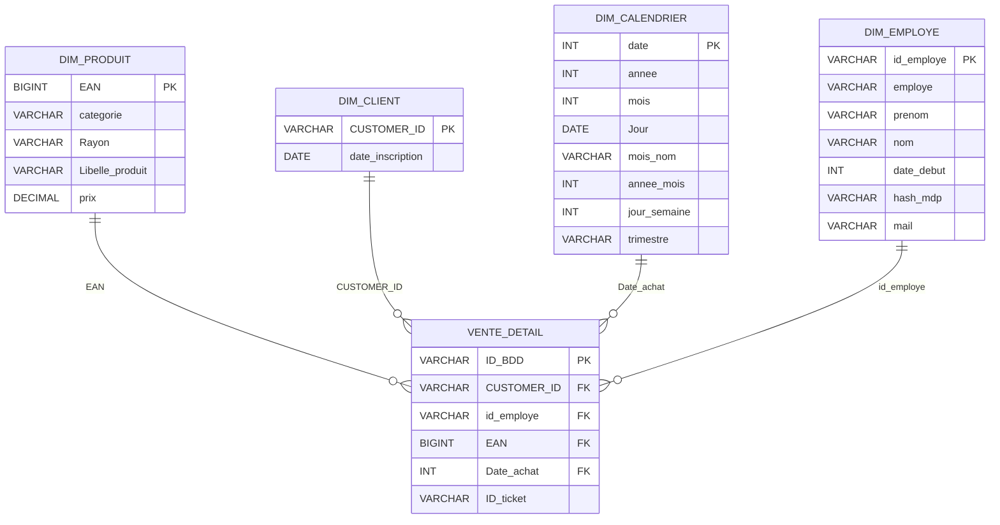

# Schéma relationnel (diagramme)

```mermaid
erDiagram
    VENTE_DETAIL {
        VARCHAR ID_BDD PK
        VARCHAR CUSTOMER_ID FK
        VARCHAR id_employe FK
        BIGINT  EAN FK
        INT     Date_achat FK
        VARCHAR ID_ticket
    }

    DIM_PRODUIT {
        BIGINT  EAN PK
        VARCHAR categorie
        VARCHAR Rayon
        VARCHAR Libelle_produit
        DECIMAL prix
    }

    DIM_CLIENT {
        VARCHAR CUSTOMER_ID PK
        DATE    date_inscription
    }

    DIM_CALENDRIER {
        INT     date PK
        INT     annee
        INT     mois
        DATE    Jour
        VARCHAR mois_nom
        INT     annee_mois
        INT     jour_semaine
        VARCHAR trimestre
    }

    DIM_EMPLOYE {
        VARCHAR id_employe PK
        VARCHAR employe
        VARCHAR prenom
        VARCHAR nom
        INT     date_debut
        VARCHAR hash_mdp
        VARCHAR mail
    }

    DIM_PRODUIT   ||--o{ VENTE_DETAIL : "EAN"
    DIM_CLIENT    ||--o{ VENTE_DETAIL : "CUSTOMER_ID"
    DIM_CALENDRIER||--o{ VENTE_DETAIL : "Date_achat"
    DIM_EMPLOYE   ||--o{ VENTE_DETAIL : "id_employe"
```
